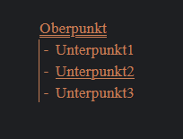
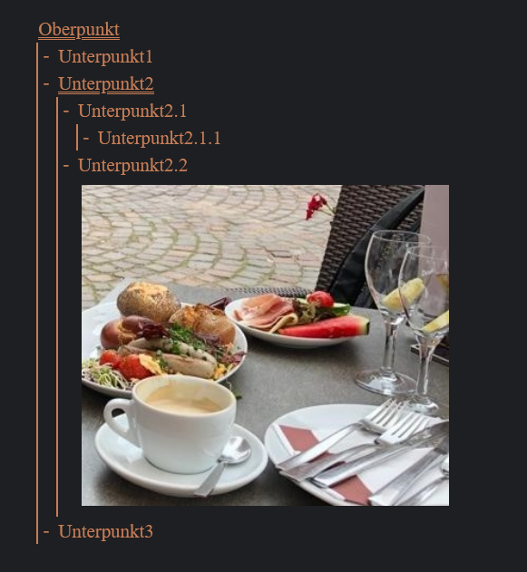

### Sems

Sems could be described as an outliner tool.
The goal of Sems is a convenient way to work with notes,
images and structured data.

#### TODO
- improve project setup
- improve project description
- refactor

#### What can you do with Sems?

Mit Sems kann man Gliederungen erstellen:

Der Unterstrich zeigt, dass man den Punkt ein- bzw. ausklappen kann:

Wenn ein Punkt außerhalb seines Kontexts zu sehen ist, dann erscheint ein entsprechender Button darunter.
Mit Klick auf "Kontext", kann man den Kontext unterhalb des Objektes aufklappen.

Objekte können an mehren Stellen "eingehängt" werden:

Es können mehrere Spalten nebeneinander angezeigt werden:

Bilder können innerhalb der Gliederung angezeigt werden:

Sems kann komplett per Tastatur bedient werden. Beispiel: Um zwischen Punkten zu navigieren werden die Buchstaben "i" und "k" verwendet (vorwärts und rückwärts).

Punkte können hinzugefügt und editiert werden.
