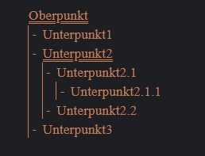
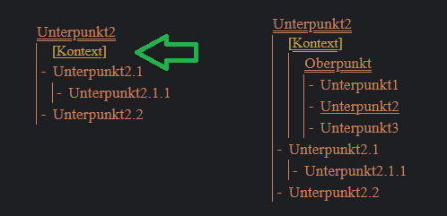
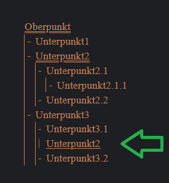

### Sems

With Sems you can maintain *content* in a flexible and systematic way.
Content means notes, texts, structured data, images and more.

#### Project Status

Sems is being developed. The first useful features will probably be available in october 2024.

#### Aspect Concept

In order to provide a high degree of flexibility, I'm trying out a new concept. It is called *aspect concept*. (see *protocol/240805 - aspect concept.txt*)

#### Predecessor

There is already a previous version of Sems. The last changes to the old version were made in April 2024.
The following describes the features of the old version.

Mit Sems kann man Gliederungen erstellen:

Der Unterstrich zeigt, dass man den Punkt ein- bzw. ausklappen kann:

Wenn ein Punkt außerhalb seines Kontexts zu sehen ist, dann erscheint ein entsprechender Button darunter.
Mit Klick auf "Kontext", kann man den Kontext unterhalb des Objektes aufklappen.

Objekte können an mehreren Stellen "eingehängt" werden:

Es können mehrere Spalten nebeneinander angezeigt werden:

Bilder können innerhalb der Gliederung angezeigt werden:

Sems kann komplett per Tastatur bedient werden. Beispiel: Um zwischen Punkten zu navigieren werden die Buchstaben "i" und "k" verwendet (vorwärts und rückwärts).

Punkte können hinzugefügt und editiert werden.

#### Visual design principle

The visual design principle of Sems is described and analyzed in this [thesis](https://www.dropbox.com/scl/fi/didrs41osq94s3agbclxn/Details-im-Kontext-anzeigen.pdf?rlkey=c374hlvzoskz4fbkevfdgfzsj&dl=0).